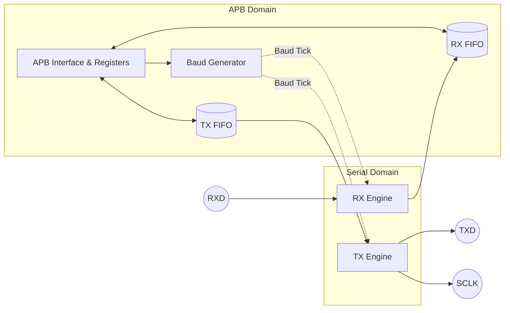

# 🚀 APB USART IP Core

[](https://opensource.org/licenses/MIT)
[](#)
[](#)

A high-performance, **Tapeout-Ready**, and **UVM-Verified** Universal Synchronous/Asynchronous Receiver-Transmitter (USART) IP Core. Designed with a standard 32-bit APB (Advanced Peripheral Bus) interface, this IP is perfectly suited for modern ARM Cortex-M and RISC-V SoC integrations.

---

## 🌟 Key Features

*   **Standard Interface:** 32-bit APB (AMBA 3/4) interface for seamless SoC integration.
*   **Dual Modes:** Supports both **Asynchronous (UART)** and **Synchronous (USART)** modes.
*   **Highly Configurable:**
    *   Baud Rate: Fully programmable fractional/integer clock divider.
    *   Data Bits: Configurable from 5 to 8 bits.
    *   Stop Bits: 1, 1.5, or 2 stop bits.
    *   Parity: Odd, Even, or None.
*   **Robust FIFOs:** Independent, parameterizable TX and RX FIFOs (Default 16-deep).
*   **Advanced Error Detection:** Hardware flags and interrupts for Parity Error, Framing Error, and Overrun Error.
*   **Glitch Filtering:** Integrated 3-stage Majority Voter on the RX line for superior noise immunity in real-world environments.
*   **Comprehensive Interrupts:** Maskable IRQs for TX Done, RX Valid, and Error states.

---

## 🏗️ Architecture Overview

The core is structured to decouple the fast APB bus domain from the slower serial shifting domain, communicating efficiently via synchronous FIFOs.



---

## 🗺️ Register Map

The IP core memory map is extremely compact, occupying a minimal footprint. Base address is determined by your SoC Interconnect.

| Offset | Register Name | Access | Description |
| :--- | :--- | :--- | :--- |
| `0x00` | **`CTRL`** | R/W | Control Register (Enable, Mode, Parity, Stop, Data Bits). |
| `0x04` | **`STATUS`** | R/O | Status Flags (RX/TX Full/Empty, TX Busy). |
| `0x08` | **`BAUDDIV`** | R/W | Baud Rate Divider (Determines serial tick generation). |
| `0x0C` | **`TXDATA`** | W/O | Transmit Data Register (Writes push directly to TX FIFO). |
| `0x10` | **`RXDATA`** | R/O | Receive Data Register (Reads pop directly from RX FIFO). |
| `0x14` | **`IRQ_EN`** | R/W | Interrupt Enable mask. |
| `0x18` | **`IRQ_STAT`** | R/W1C | Interrupt Status flags. Write `1` to a bit to clear it. |
| `0x1C` | **`FIFOCTRL`** | R/W | FIFO Control (Write to clear TX/RX FIFOs). |
| `0x20` | **`VERSION`** | R/O | IP Version identifier. |

> [!IMPORTANT]  
> **Loss-of-Interrupt Protection:** The `IRQ_STAT` register employs strict write-1-to-clear logic that safely merges software clears with simultaneous hardware triggers, guaranteeing zero missed interrupts.

---

## 💻 Integration Guide

Instantiating the `apb_usart_wrapper` is straightforward. All ports follow strict AMBA APB naming conventions.

```verilog
apb_usart_wrapper #(
    .C_APB_DATA_WIDTH (32),
    .C_APB_ADDR_WIDTH (8),
    .FIFO_DEPTH       (16)
) u_usart (
    // Clock and Reset
    .i_usart_pclk     (sys_clk),
    .i_usart_presetn  (sys_rst_n),

    // APB Interface
    .i_usart_paddr    (apb_paddr),
    .i_usart_psel     (apb_psel),
    .i_usart_penable  (apb_penable),
    .i_usart_pwrite   (apb_pwrite),
    .i_usart_pwdata   (apb_pwdata),
    .i_usart_pstrb    (apb_pstrb),
    .o_usart_prdata   (apb_prdata),
    .o_usart_pready   (apb_pready),
    .o_usart_pslverr  (apb_pslverr),

    // Serial Pins
    .o_usart_txd      (uart_tx),
    .i_usart_rxd      (uart_rx),
    .o_usart_sclk     (uart_sclk), // Optional for Sync Mode

    // Interrupt
    .o_usart_irq      (usart_irq)
);
```

> [!TIP]
> **Tapeout Readiness:** The RTL has been fully scrutinized for silicon tapeout. It utilizes purely behavioral standard constructs, making it 100% technology-independent. Synthesis tools will automatically map the logic to your Foundry's standard cells (e.g., TSMC, GlobalFoundries).

---

## 🛡️ Verification (UVM)

This IP comes with an industrial-grade **Universal Verification Methodology (UVM)** testbench located in the `uvm/` directory.

### Quick Start (Questa/ModelSim)
To compile and run the comprehensive smoke test that verifies APB setup, baud generation, and RX/TX FIFO loopback:

```sh
cd apb-usart-core
make run UVM_TEST=apb_usart_smoke_test
```
